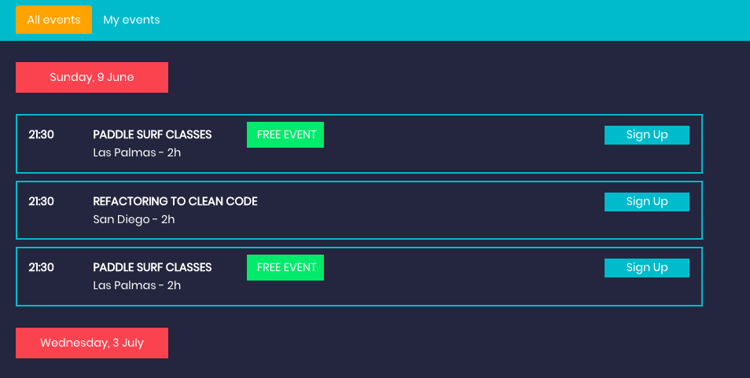
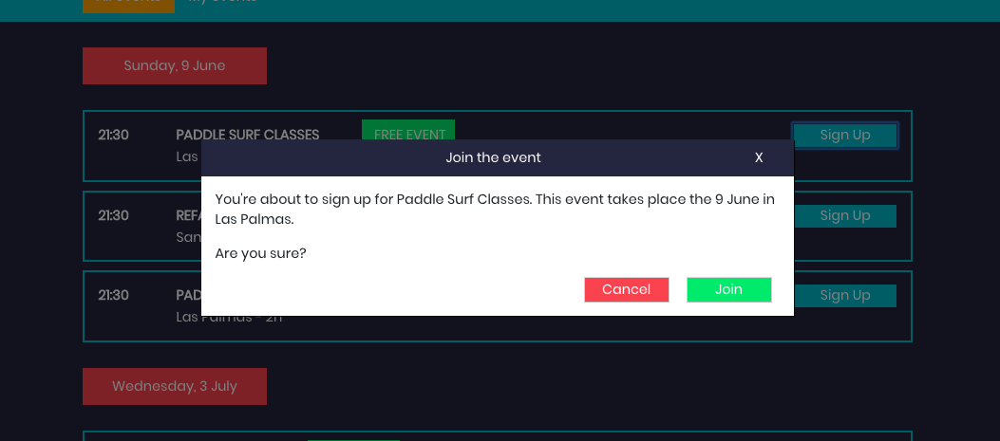
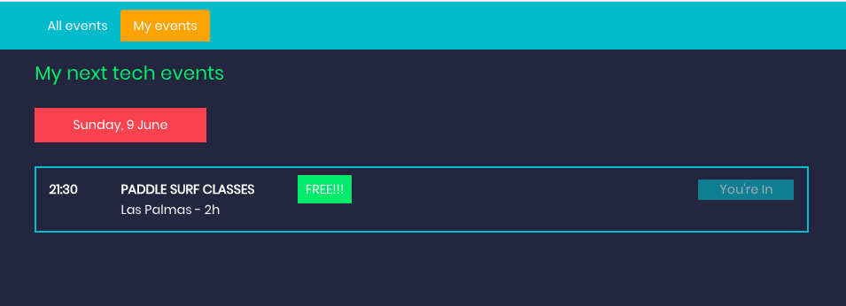

# Readme

Run Mock API: `json-server --watch src/assets/events.json --port 4000`

Run Frontend: `npm start`

## EventCal is a SPA with the following views:
* `All events` view where the user can see all the tech.
* `My events` view where the user can see the ones which they signed up for.

### Tech stack used:
* React
* ES6
* CSS
* HTML

#### 1 - Mock an API
**1.1 Mockup:** Included are two JSON files with data: events.json and cities.json. The objective is to mock up a REST API that returns the data contained in the JSON files.

#### 2 - `All events` view
**2.1 All events view** is the view where you can see all the events and the information about them.

#### 3 - Event sign up
**3.1 Sign up** Next to each event, there is a button to sign up. When clicking, a
confirmation modal will appear and the user can sign up or cancel. 

#### 4 `My events` view
**4.1 My events view** After signing up in some events in the all events view,
the user wants to see which ones they have signed up. From this view, the user can cancel
the attendance to the event by clicking on the cancel button.

## TODO
**2.2 Filters** Add three filters above the list where the user can:
 - Search by the name of the event and/or the city [searchbar]
 - Show only the free ones [check box]
 - Show only the events that occur during the morning (6am - 12 pm), afternoon (12pm - 17pm), evening (17pm - 21pm) or night (21pm - 6am) [dropdown]

**2.3 Responsive layout** Create a responsive layout.

## Current State - screenshots

